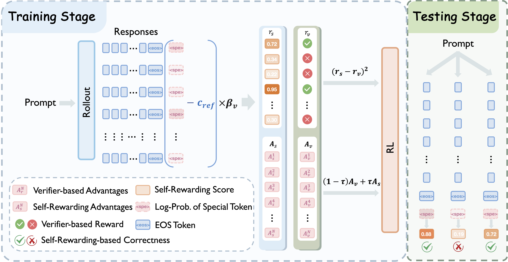

# LaSeR: Reinforcement Learning with Last-Token Self-Rewarding
[](https://arxiv.org/abs/2505.00662)
[](https://huggingface.co/collections/Keven16/laser-68eddd427d58817e2b09373a)


We propose **LaSeR**, a lightweight and effective algorithm that simultaneously optimizes both the reasoning and self-rewarding capabilities of LLMs with minimal additional cost, by introducing a simple MSE loss into the standard RLVR objective. The optimized self-rewarding scores can serve as auxiliary reward signals in both training and testing stages to enhance model performance.

<div style="display: flex; justify-content: center; flex-wrap: wrap;">
    
</div>

---------

## News
- [2025.10.16] We release our paper on [arxiv](https://arxiv.org/pdf/2505.00662). We release the source code and the checkpoints.


## Models
|           Name         |   |
|------------------------|:------|
| Octothinker-3B-Short-LaSeR  | [hf model](https://huggingface.co/Keven16/OctoThinker-3B-Short-LaSeR)   |
| Qwen2.5-7B-LaSeR | [hf model](https://huggingface.co/Keven16/Qwen2.5-7B-LaSeR) |
| ORZ-7B-LaSeR | [hf model](https://huggingface.co/Keven16/ORZ-7B-LaSeR) |

## Data
The evaluation data is in the ``data/`` directory. The processed training data can be downloaded from [here](https://huggingface.co/datasets/Keven16/LaSeR_training_data).

## Installation
Our code is mainly based on [verl](https://github.com/volcengine/verl) (v0.5.0). To prepare the environment, please follow these steps:
```bash
conda create -n verl python==3.10
conda activate verl
cd verl/
USE_MEGATRON=0 bash scripts/install_vllm_sglang_mcore.sh
pip install math-verify
```

## Training

We provide example scripts for GRPO and LaSeR training in the `examples/grpo_trainer/`. Before running, please download the related datasets to the appropriate locations.

### Quick Start

For experiments on Qwen2.5-7B-Base and ORZ-7B:
```bash
cd verl/
bash examples/grpo_trainer/run_qwen2_5_7b.sh
```

For experiments on OctoThinker-3B-Short-Base:
```bash
cd verl/
bash examples/grpo_trainer/run_octothinker_3b.sh
```

You can modify these scripts to adapt training parameters and paths for your own settings. The scripts include all necessary hyper-parameters. Detailed hyper-parameter explanations are in the ```verl/verl/trainer/config/actor/actor.yaml```.

Make sure to set your `WANDB_API_KEY` if you want to use Weights & Biases logging.


## Evaluation
Our evaluation code is in the ``src/`` folder. 

Ideally, the self-rewarding score can be calculated directly by performing an additional forward process after the model generates the `<EOS>` token, obtaining the prediction probability for the pre-specified self-rewarding token. However, this requires modifying the underlying sampling logic of [vLLM](https://github.com/vllm-project/vllm). In the current version, we have chosen to concatenate the pre-specified tokens after the solutions have been fully generated and then perform separate forward process to obtain the self-rewarding scores. We welcome the community to contribute a PR for a vLLM version that adapts to our method to enable more efficient self-rewarding!

For now, users can run the following script to perform evaluation on the reasoning and self-rewarding capabilities of the target model:
```bash
CUDA_VISIBLE_DEVICES=0,1,2,3 sh scripts/run_eval_math.sh
```

## Acknowledgments
Our training code is mainly based on [verl](https://github.com/volcengine/verl). Our training data is adopted from [DeepMath-103K](https://github.com/zwhe99/DeepMath). We sincerely thank the contributors for their open-sourcing!


## Citation
If you find our work helpful, please kindly cite as
```bibtex

```